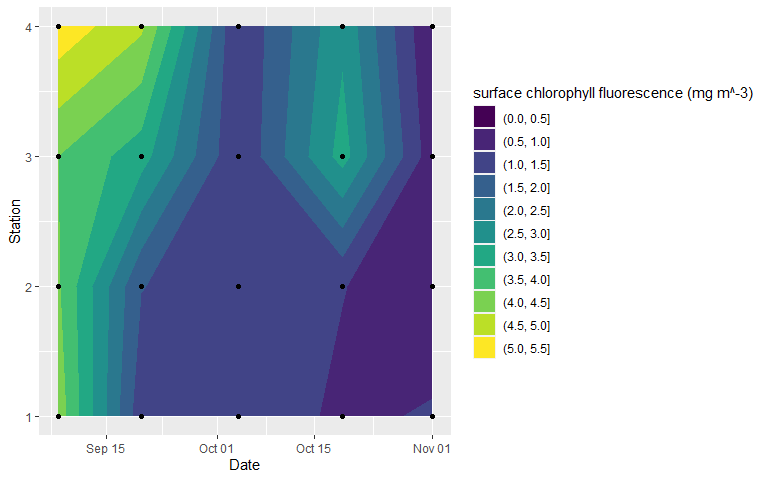
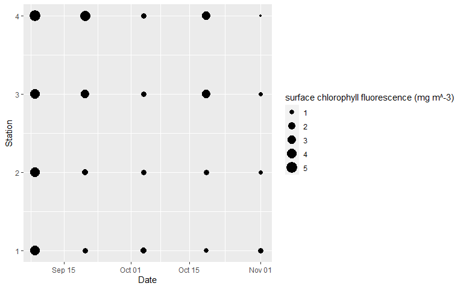
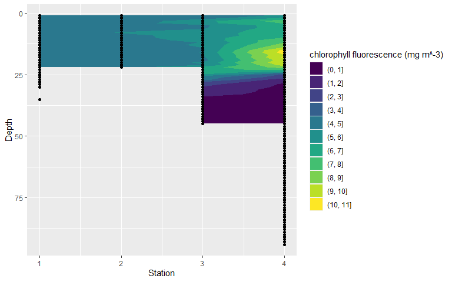
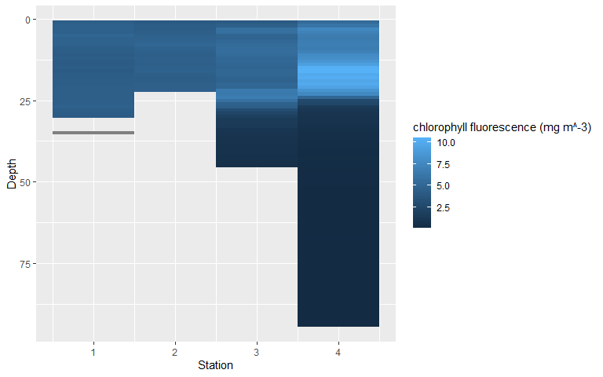
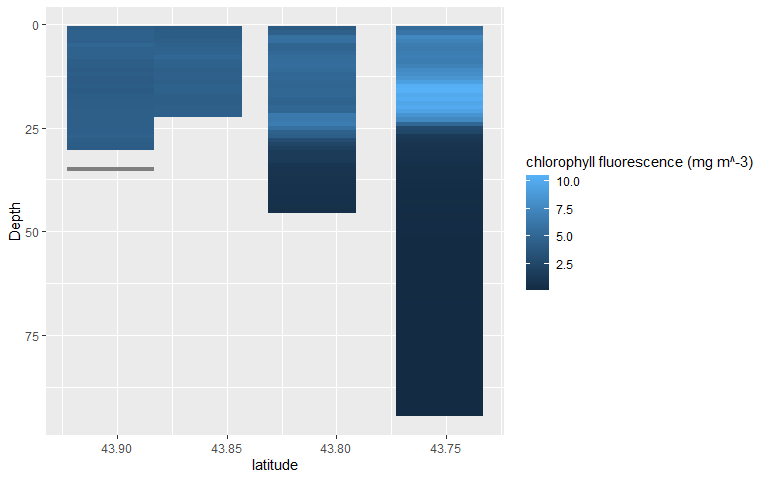
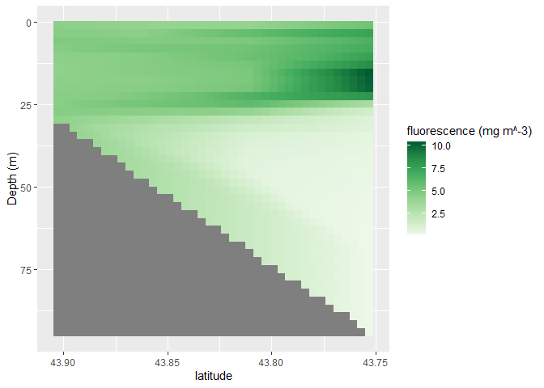
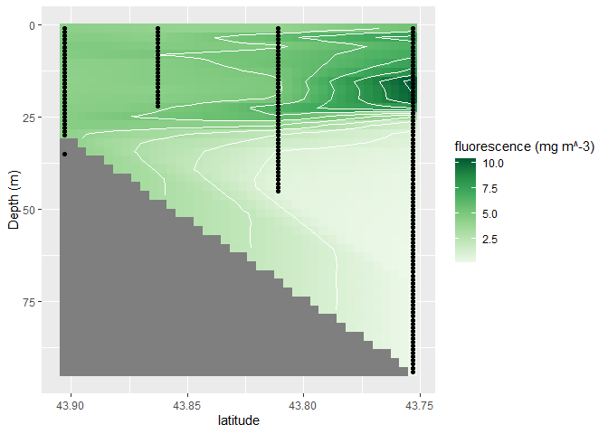

Visualizing change: Plotting relationships between multiple variables
================

# Lab Outcomes

1.  Use contour and scatter plots to visualize three variables.
2.  Interpolate data between measured values to make heatmaps for
    visualizing change.

This lab is adapted from a R workshop hosted at Bigelow. For reference,
that R workshop can be found on GitHub at:
[cathmmitchell/plottingOceanDataWithR](https://github.com/cathmmitchell/plottingOceanDataWithR/blob/main/plottingOceanDataWithR.md)

Today we are going to use the `DaRTS_combined_data.csv` file that we
made in Lab 3.

# Introduction

In our initial exploration of the data, we’ve looked at how to plot some
variables under some limited conditions e.g. profiles for one cruise, or
relationships between a couple of variables for all cruises. We could
have used Excel to do this plotting. But what about if we want to
visualize our data in a different way that represented the time and
space components of field data or if we wanted a more complicated subset
of our data? That’s where R comes in really handy.

What we’re going to work towards here is plotting oceanographic data in
similar way to [Ocean Data View](https://odv.awi.de/). By the end of the
tutorial, we’ll have created:


And I’ll provide you with some resources for how to recreate the above
figure under different requirements e.g. for a different variable, or
different cruise.

But, it’s worth pointing out here that all the methods we’ll be using
can be used on any type of data - and we’ll see some examples as we go
through the tutorial.

# Initializing our R Session

Let’s start by setting up our R session. These are good steps to take at
the start of any R session.

1.  Set the working directory:

``` r
setwd("C:/Users/cmitchell/Documents/SeaChangeSemester/2021/Labs/sea-change-semester-data-labs/Lab05/")
```

2.  Open a new script
3.  Save the new script e.g. `Lab05.R`
4.  Import the libraries we’ll use today

``` r
library(ggplot2)
```

    ## Warning: package 'ggplot2' was built under R version 4.0.5

``` r
library(dplyr)
```

    ## Warning: package 'dplyr' was built under R version 4.0.5

    ## 
    ## Attaching package: 'dplyr'

    ## The following objects are masked from 'package:stats':
    ## 
    ##     filter, lag

    ## The following objects are masked from 'package:base':
    ## 
    ##     intersect, setdiff, setequal, union

``` r
library(lubridate)
```

    ## Warning: package 'lubridate' was built under R version 4.0.5

    ## 
    ## Attaching package: 'lubridate'

    ## The following objects are masked from 'package:base':
    ## 
    ##     date, intersect, setdiff, union

5.  Import our data

``` r
DATA <- read.csv("DaRTS_combined_data.csv")
```

# Contour and Bubble Plots

Let’s start with the following question:

**How does surface chlorophyll fluorescence change at each station over
the 2016 sampling season?**

Surface can be defined in multiple ways and the exact choices you make
will depend on your data and your situation. Here, we are going to say
surface chlorophyll fluorescence is the average value over the top 1 m.

If you want to take the surface value as the average over the top 2 m
(or any other depth), you will need to go back to the raw CTD data and
redo the grouping and binning step we did in Lab 3. In this case, rather
than rounding all the CTD data to the nearest meter, you’d filter for
your specified depth. The R Workshop we hosted at Bigelow follows this
approach, so check that out if you are interested.

We are going to create a couple of different figures that show surface
chlorophyll fluorescence with date along the x-axis and station along
the y-axis.

**Another example:** Say you’ve got three cultures that you’re testing
four different treatments on. For each culture/treatment combination,
you’re measuring cell counts at a series of time points. What you’d like
to visualize/plot is the average cell counts over the first two time
points for each culture and treatment.

How do the variables in these examples compare?

| Field Data | Lab Experiment |
|:-----------|:---------------|
| station    | treatment      |
| date       | culture        |
| depth      | time point     |

## Data Manipulation

First, we are going to be plotting based on date, so we need to convert
the dates to R dates (like we did in Lab 3).

``` r
DATA <- DATA %>% mutate(Date = lubridate::ymd(DATA$Date))
```

Our data frame contains data from 2012 - 2020, so we need to `filter`
the data frame based on year and depth:

``` r
chldata2016 <- DATA %>% filter(year == 2016, Depth == 1)
```

## Visualizing data using a contour plot

We can visualize this type of data with a contour plot (using
`geom_contour_filled()`). We want to label the color bar, so in this
case, our argument to the `labs()` function for the legend (color bar)
is going to be `fill`.

``` r
ggplot(chldata2016,aes(x=Date,y=Station)) +
  geom_contour_filled(aes(z=Fluorescence_mg_m3)) +
  geom_point() +
  labs(fill='surface chlorophyll fluorescence (mg m^-3)')
```

<!-- -->

We can reformat the x-axis dates if we wished - see details in the
[Formatting Dates
wiki](https://github.com/cathmmitchell/plottingOceanDataWithR/wiki/Formatting-dates)
that is part of the R Workshop we did at Bigelow.

We can also change the locations of the x-ticks. How we do this depends
on our data type - see some examples in the [x-tick
wiki](https://github.com/cathmmitchell/plottingOceanDataWithR/wiki/x-ticks-and-x-tick-labels)
(also from Bigelow’s R Workshop).

In this case, if we know what x-tick positions we want, we could specify
them in a call to `scale_x_date()`. Recall to get a list of the cruise
dates we can use `unique`:

``` r
unique(chldata2016$Date)
```

    ## [1] "2016-09-08" "2016-09-20" "2016-10-04" "2016-10-19" "2016-11-01"

So we can use this in our call to `scale_x_date()`:

``` r
ggplot(chldata2016,aes(x=Date,y=Station)) +
  geom_contour_filled(aes(z=Fluorescence_mg_m3)) +
  geom_point() +
  labs(fill='surface chlorophyll fluorescence (mg m^-3)') +
  scale_x_date(breaks=unique(chldata2016$Date))
```

<!-- -->

Here, the dots (from `geom_point`) show where the measurements were
made, and the contours filled in the gaps. This helps us to visualize
the time and space changes in chlorophyll fluorescence.

If we think about our lab experiment example, what our figure would show
is treatment on the y-axis, culture on the x-axis, and cell counts as
the contours. In that case - does it make sense to have the cell counts
fill the gaps between the treatment and culture? No - the treatments and
cultures are separate from each other. They are not connected in this
temporal or spatial way. So while the *data manipulation* was the same
for each data set, the *data visualization* isn’t.

## Visualizing data using a bubble plot

We are going to plot a scatter plot, where the size of each point
represents the chlorophyll fluorescence. In this case, our argument to
the `labs()` function for the legend is going to be `size`.

``` r
ggplot(chldata2016,aes(x=Date,y=Station)) +
  geom_point(aes(size=Fluorescence_mg_m3)) +
  labs(size='surface chlorophyll fluorescence (mg m^-3)')
```

<!-- -->

# Interpolating and visualizing data

The approach in previous section works well when your data are
consistent in terms of the variables you want to compare. For the data
we plotted above, there were five different cruises, and on each cruise,
data was collected at the same four locations. We had data for every
cruise and station. If we’d been missing data at one of the stations on
one of the cruises, we’d just have a blank part on the plots we made.
But what if we were missing a lot of data - would the above approach
still be a good way to visualize our data?

To dig into this a bit further, let’s consider how chlorophyll
fluorescence varies by depth at each station *for one cruise*.

We need to do a bit of data manipulation again to create a data frame
we’ll use for plotting. In this case, we’re going to have station on the
x-axis and depth on the y-axis, and we’ll consider the cruise that took
place on September 8th 2016.

``` r
cruiseData <- filter(DATA, Date=="2016-09-08")
```

We now have a data frame that includes data for just one cruise - so
let’s use the same approach as before to create a contour plot:

``` r
ggplot(cruiseData,aes(x=Station,y=Depth)) +
  geom_contour_filled(aes(z=Fluorescence_mg_m3)) +
  geom_point() +
  labs(fill='chlorophyll fluorescence (mg m^-3)') +
  scale_y_reverse() #flip y-axis
```

    ## Warning: Removed 1 rows containing non-finite values (stat_contour_filled).

<!-- -->

This looks good, but what this plotting function doesn’t do is
interpolate data between missing data points. We know we have data at
station 4 below 50 m that isn’t represented in this plot. Can we use a
different function to show those data too? Yes - `geom_tile()`.

``` r
ggplot(cruiseData,aes(x=Station,y=Depth)) +
  geom_tile(aes(fill=Fluorescence_mg_m3)) +
  labs(fill='chlorophyll fluorescence (mg m^-3)') +
  scale_y_reverse()
```

<!-- -->

Let’s go back to the lab experiment example: could it be plotted in this
way?

Yes - depth could represent time points, and station could represent
treatment.

## Interpolation

With our field data one axis has been station number i.e. it is a given
location. We might want to space out the data on the x-axis based on
those locations, rather than station number, so we can visualize our
data with a representative separation between the data points. For this
data set, the stations are on a similar longitude, so looking at
latitude will give a good representation of the separation between the
stations. For cruise or sampling tracks where both latitude and
longitude are variable, this could be distance along the cruise path or
field transect.

Our dataframe doesn’t have the latitude in it, only the station numbers.
So we need to first redo include latitude in our data frame. To do this
we are going to use **conditional statements**.

### Coding technique: Conditional Statements

A conditional statement is one that tells you to do something based on a
condition e.g. if there is cake in the supermarket, then buy 1.
Sometimes, there might be a different action to take if the condition is
false e.g. if there is cake in the supermarket, then buy 1, else buy 1
loaf of bread.

Here, the important words are **if**, **then** and **else**. Together,
these make up something called an **if-else** statement. Sometimes it
easier to visualize these as flow charts:

<center>

</center>

If we didn’t have the `else` statement, then, the default is to do
nothing if the first condition is false.

There’s a couple of different ways to code `if` and `if-else` statements
in R. To code this in R, we would do the following:

    if(condition){
      code if TRUE
    } else {
      code if FALSE
    }

But we could also write this as the following:

    ifelse(condition, code if true, code if false)

How can we use this idea for including the latitudes into our data
frame? We can think of this process as:

-   if station = 1, then latitude = 43.903
-   if station = 2, then latitude = 43.863
-   if station = 3, then latitude = 43.811
-   if station = 4, then latitude = 43.753.

That’s a lot of statements. Let’s try and visualize this:

<center>

</center>

What do we do if our test for station 1 is false (i.e. if we are at
station 2, 3 or 4)? We could test if it is station 2. Then, if it is,
assign the station 2 latitude value, else test if it is station 3. Then,
if it is station 3, we could assign the station 3 latitude value, else
test if it is station 4. Then, if it is station 4, we could assign the
station 4 latitude value. What do we do if the final test (i.e. station
4) is false? That means it isn’t ANY of the stations, so there’s
probably an error somewhere in our dataset, and we should set that
latitude to Not-A-Number (NaN).

Let’s first look at this visually:

<center>

</center>

How do we combine all these statements into some R code? We can use the
`ifelse` function. Recall it has the form:

    ifelse(condition, code if true, code if false)

In our case, we have to include an `ifelse` statement as the
`code if false` part:

    ifelse(station1test, latitude = value1, ifelse(station2test, latitude = value2, code if false))

And keep doing this for all the stations:

    ifelse(station1test, latitude = value1, 
    ifelse(station2test, latitude = value2, 
    ifelse(station3test, latitude = value3,
    ifelse(station4test, latitude = value4,NaN))))

Let’s just split this up to see what’s going on more clearly. We’ll
start with the last `ifelse`:

<center>

</center>

In the above image, the part in the solid grey box is the
`code if false` part for the last `ifelse` statement. For the 3rd
`ifelse`:

<center>

</center>

The part in the dashed green box is the `code if false` part for the 3rd
`ifelse` statement. For the 2nd `ifelse`:

<center>

</center>

The part in the dotted orange box is the `code if false` part for the
2nd `ifelse` statement. For the 1st `ifelse`:

<center>

</center>

The part in the solid blue box is the `code if false` part for the 1st
`ifelse`.

And finally, putting this all together:

``` r
latitude = ifelse(cruiseData$Station == 1, 43.903,ifelse(cruiseData$Station == 2, 43.863,ifelse(cruiseData$Station == 3, 43.811,ifelse(cruiseData$Station == 4,43.753,NaN))))
```

Now let’s add this column of latitudes to our dataframe and make our
plot:

``` r
cruiseData <- cruiseData %>% mutate(latitude = latitude)

ggplot(cruiseData,aes(x=latitude,y=Depth)) +
  geom_tile(aes(fill=Fluorescence_mg_m3)) +
  labs(fill='chlorophyll fluorescence (mg m^-3)') +
  scale_y_reverse() +
  scale_x_reverse() # flipping so station 1 is on the left
```

<!-- -->

What we end up with is this plot where we have gaps between each station
measurement because our sampling stations are not equally spaced in
terms of latitude. What we can do is estimate what the chlorophyll
fluorescence would be in between where we have our samples i.e. we can
interpolate our data.

We are going to do the bilinear interpolation on our data, which means
we are going to estimate chlorophyll fluorescence values over regularly
spaced latitude and depth values. This is something that’s maybe more
common when working with geospatial data. But in our lab experiment
case, maybe we’d be interested in interpolating our cell counts between
our different time points.

We’re going to use a handy function from the `akima` package to do all
the hard work for us. But first, we need to make sure we have no nans in
our data. Recall we did this last day.

``` r
# removing the NaNs and Infs:
# 1) make a boolean list of the good values
nonans <- is.finite(cruiseData$Fluorescence_mg_m3)
# 2) index fluorescence, latitude and depth columns using our boolean list
latnonan <- cruiseData$latitude[nonans]
flnonan <- cruiseData$Fluorescence_mg_m3[nonans]
depthnonan <- cruiseData$Depth[nonans]
```

Next we can do the interpolation

``` r
library(akima)
```

    ## Warning: package 'akima' was built under R version 4.0.3

``` r
#interpolate our data:
interpReference <- interp(latnonan, depthnonan, flnonan)
```

What does `interpReference` look like? It is a list with 3 items:

1.  `x`, which is a list of 40, regularly spaced latitudes
2.  `y`, which is a list of 40, regularly spaced depths
3.  `z`, which is a 40 x 40 grid (or **matrix**), where each **element**
    (number in the grid) corresponds to one of the depth (columns) and
    latitude (rows) values. For example,
    1.  the `z` value in the first row and first column corresponds to
        the first latitude and depth values
    2.  the `z` value in the first row and second column corresponds to
        the first latitude, and second depth value
    3.  the `z` value in the second row and first column corresponds to
        the second latitude, and first depth value

Here’s an example for a smaller matrix:

<center>

</center>

What we now need to do is get our data into a data frame format for
`ggplot`. One way to do this is use the `expand.grid` function to create
a data frame from all combinations of the latitude and depth vectors.
Then flatten the interpolated data matrix into a vector and add it as a
column in the data frame.

``` r
# making data frame from all combinations of latitude and depth
CruiseDataInterp <- expand.grid(latitude=interpReference$x,
                                depth = interpReference$y) %>%
  mutate(fluorescence = as.vector(interpReference$z))
```

*Note: Something to be aware of with the above step is if the matrix is
flattened row-wise or column-wise. To make sure the flattened matrix
elements align with the correct latitude and depth pair, you might need
to transpose your matrix first (flip it along the diagonal)
`t(interpReference$z)`*

Now we have our data frame - can we plot our data as before?

``` r
ggplot(CruiseDataInterp, aes(x=latitude, y=depth)) +
  geom_tile(aes(fill = fluorescence)) +
  scale_y_reverse() +
  scale_x_reverse() + #so station1 is on the left and station4 is on the right
  labs(y="Depth (m)", fill="fluorescence (mg m^-3)") +
  scale_fill_distiller(palette="Greens",direction=1)
```

<!-- -->

We can include the sample locations and contour lines to make it clear
where the interpolation is happening:

``` r
ggplot(CruiseDataInterp, aes(x=latitude, y=depth)) +
  geom_tile(aes(fill = fluorescence)) +
  geom_contour(aes(z = fluorescence),color="white") +
  geom_point(data = cruiseData, aes(x=latitude, y=Depth),color="black") + #adding in the measurement locations
  scale_y_reverse() +
  scale_x_reverse() + #so station1 is on the left and station4 is on the right
  labs(y="Depth (m)", fill="fluorescence (mg m^-3)") +
  scale_fill_distiller(palette="Greens",direction=1)
```

    ## Warning: Removed 557 rows containing non-finite values (stat_contour).

<!-- -->

*Note: In this case (the Damariscotta River) we interpolated below the
measured depths. But those interpolations don’t make sense here because
the profiles are full water column i.e. depth was limited by
bathymetery.*

In this example, we’ve interpolated our data over depth and latitude.
But, we could have focused on one station and done depth by date
instead. These techniques we’ve been learning are not only for this
dataset and these specific parameters. What we’ve been learning are
specific skills and techniques that can be applied to any type of data.

# Next steps: Functions and For Loops

The last figure we created was for one variable, for one cruise. What if
we want to look at a different variable? Or a different cruise? It would
be nice to have a function to regenerate a plot quickly.

You could write a function that creates the above figure.

For loops are a way we can repeat a specific task a set number of times.
For example, you could create plots for every cruise in 2016.

We don’t have time to go over functions and for loops, but see [the
Bigelow R Workshop
tutorial](https://github.com/cathmmitchell/plottingOceanDataWithR/blob/main/plottingOceanDataWithR.md#functions-and-for-loops-for-creating-multiple-versions-of-figures)
for a detailed walk-through.
